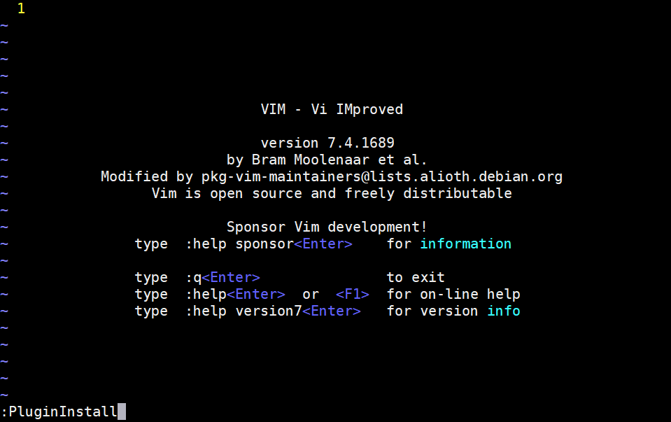
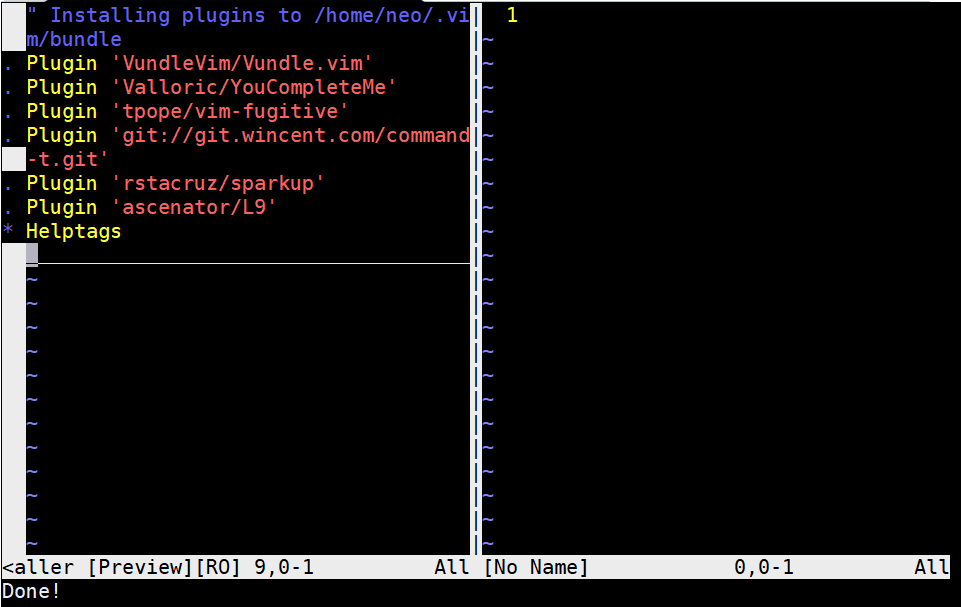

# Vim Setting

## Vim 8

### Method 1 - Install via PPA 
    sudo add-apt-repository ppa:pkg-vim/vim-daily
    sudo apt-get update
    sudo apt-get upgrade

    # Display vim information
    vim --version

### Method 2 - Build from source

Remove old version of Vim

    sudo apt-get remove vim vim-runtime gvim

Required library

    sudo apt-get install libncurses5-dev

Clone from Github and build

    git clone https://github.com/vim/vim.git
    cd vim/

    # Configure according to your requirment
    # Setting below successed in Ubuntu 14.04

    ./configure --enable-multibyte
     --enable-pythoninterp=dynamic 
     --with-python-config-dir=/usr/lib/python2.7/config-x86_64-linux-gnu 
     --enable-python3interp 
     --with-python3-config-dir=/usr/lib/python3.4/config-3.4m-x86_64-linux-gnu 
     --enable-cscope 
     --enable-gui=auto 
     --with-features=huge 
     --with-x 
     --enable-fontset 
     --enable-largefile 
     --disable-netbeans 
     --with-compiledby=sh1r0 
     --enable-fail-if-missing
     --enable-perlinterp=dynamic 
     --enable-rubyinterp=dynamic 
     --with-ruby-command=/usr/bin/ruby 

    make 
    sudo make install
## Youcompleteme

### Installation
Vundle (pluging manager)
    
    # Vundle relies on git & curl
    sudo apt-get install git curl

    git clone https://github.com/gmarik/vundle.git ~/.vim/bundle

    vim ~/.vimrc

Add script below to vimrc

    set nocompatible           " be iMproved, required
    filetype off               " required

    " set the runtime path to include Vundle and initialize
    set rtp+=~/.vim/bundle/Vundle.vim
    call vundle#begin()
    " alternatively, pass a path where Vundle should install plugins
    "call vundle#begin('~/some/path/here')

    " let Vundle manage Vundle, required
    Plugin 'VundleVim/Vundle.vim'
    Plugin 'Valloric/YouCompleteMe'

    " The following are examples of different formats supported.
    " Keep Plugin commands between vundle#begin/end.
    " plugin on GitHub repo
    Plugin 'tpope/vim-fugitive'
    " plugin from http://vim-scripts.org/vim/scripts.html
    " Plugin 'L9'
    " Git plugin not hosted on GitHub
    Plugin 'git://git.wincent.com/command-t.git'
    " git repos on your local machine (i.e. when working on your own plugin)
    Plugin 'file:///home/gmarik/path/to/plugin'
    " The sparkup vim script is in a subdirectory of this repo called vim.
    " Pass the path to set the runtimepath properly.
    Plugin 'rstacruz/sparkup', {'rtp': 'vim/'}
    " Install L9 and avoid a Naming conflict if you've already installed a
    " different version somewhere else.
    " Plugin 'ascenator/L9', {'name': 'newL9'}

    " All of your Plugins must be added before the following line
    call vundle#end()            " required
    filetype plugin indent on    " required
    " To ignore plugin indent changes, instead use:
    "filetype plugin on
    "
    " Brief help
    " :PluginList       - lists configured plugins
    " :PluginInstall    - installs plugins; append `!` to update or just :PluginUpdate
    " :PluginSearch foo - searches for foo; append `!` to refresh local cache
    " :PluginClean      - confirms removal of unused plugins; append `!` to auto-approve removal
    "
    " see :h vundle for more details or wiki for FAQ
    " Put your non-Plugin stuff after this line

In vim, enter command :PluginInstall

Vundle would install plugins according to your vimrc config

Required library

    sudo apt-get install build-essential cmake python-dev  python3-dev clang

Compile Youcompleteme

    cd ~/.vim/bundle/YouCompleteMe

    # Build with C language family support
    ./install.py --clang-completer

### YCM configure file

    vim ~/.vim/ycm_extra_conf.py

Add content below to ycm_extra_conf.py

    import os
    import ycm_core

    flags = [
        '-Wall',
        '-Wextra',
        '-Werror',
        '-Wno-long-long',
        '-Wno-variadic-macros',
        '-fexceptions',
        '-DNDEBUG',
        '-std=c++11',
        '-x',
        'c++',
        '-I',
        '/usr/include',
        '-isystem',
        '/usr/lib/gcc/x86_64-linux-gnu/5/include',
        '-isystem',
        '/usr/include/x86_64-linux-gnu',
        '-isystem'
        '/usr/include/c++/5',
        '-isystem',
        '/usr/include/c++/5/bits'
    ]

    SOURCE_EXTENSIONS = [ '.cpp', '.cxx', '.cc', '.c', ]

    def FlagsForFile( filename, **kwargs ):
    return {
        'flags': flags,
        'do_cache': True
    }

Add path of ycm_extra_conf.py and YCM configure in vimrc

    vim ~/.vimrc

    # Add content below into vimrc
    let g:ycm_global_ycm_extra_conf='~/.vim/ycm_extra_conf.py'
    let g:ycm_confirm_extra_conf = 0

    let g:ycm_semantic_triggers =  {
              \ 'c,cpp,python,java,go,erlang,perl': ['re!\w{2}'],
              \ 'cs,lua,javascript': ['re!\w{2}'],
              \ }
    let g:ycm_filetype_whitelist = { 
			\ "c":1,
			\ "cpp":1, 
			\ "objc":1,
                        。。。。
			\ "sh":1,
			\ "zsh":1,
			\ "zimbu":1,
			\ }

Use monokai theme
    
    cd ~/.vim/
    git clone https://github.com/sickill/vim-monokai.git

    cp -r vim-monokai/colors/ .

    # Add content below to vimrc
    syntax enable
    colorscheme monokai

Use grey style menu 

    # Add content below to vimrc
    highlight PMenu ctermfg=0 ctermbg=242 guifg=black guibg=darkgrey
    highlight PMenuSel ctermfg=242 ctermbg=8 guifg=darkgrey guibg=black

## C/C++ Related Tools

ctags & cscope

    sudo apt-get install exuberant-ctags cscope

In your project folder, generate tag file in all directory recursively

    ctags -R

In your project folder, generate index file in all directory recursively
    
    cscope -Rbqk

Add content below to vimrc

    """cscope Setting
    set cscopetag
    set csto=0

    if filereadable("cscope.out")
        cs add cscope.out   
    elseif $CSCOPE_DB != ""
        cs add $CSCOPE_DB
    endif

    set cscopeverbose

    nmap zs :cs find s <C-R>=expand("<cword>")<CR><CR>
    nmap zg :cs find g <C-R>=expand("<cword>")<CR><CR>
    nmap zc :cs find c <C-R>=expand("<cword>")<CR><CR>
    nmap zt :cs find t <C-R>=expand("<cword>")<CR><CR>
    nmap ze :cs find e <C-R>=expand("<cword>")<CR><CR>
    nmap zf :cs find f <C-R>=expand("<cfile>")<CR><CR>
    nmap zi :cs find i ^<C-R>=expand("<cfile>")<CR>$<CR>
    nmap zd :cs find d <C-R>=expand("<cword>")<CR><CR>

## Reference
- [https://github.com/ycm-core/YouCompleteMe](https://github.com/ycm-core/YouCompleteMe)
- [https://vimjc.com/install-vim-and-vimcdoc.html](https://vimjc.com/install-vim-and-vimcdoc.html)
- [https://vimjc.com/vim-plugin-manager.html](https://vimjc.com/vim-plugin-manager.html)

- [https://ivan7645.github.io/2016/07/12/vim_to_si/](https://ivan7645.github.io/2016/07/12/vim_to_si/)

## For Python Developer
- [https://github.com/fisadev/fisa-vim-config](https://github.com/fisadev/fisa-vim-config)