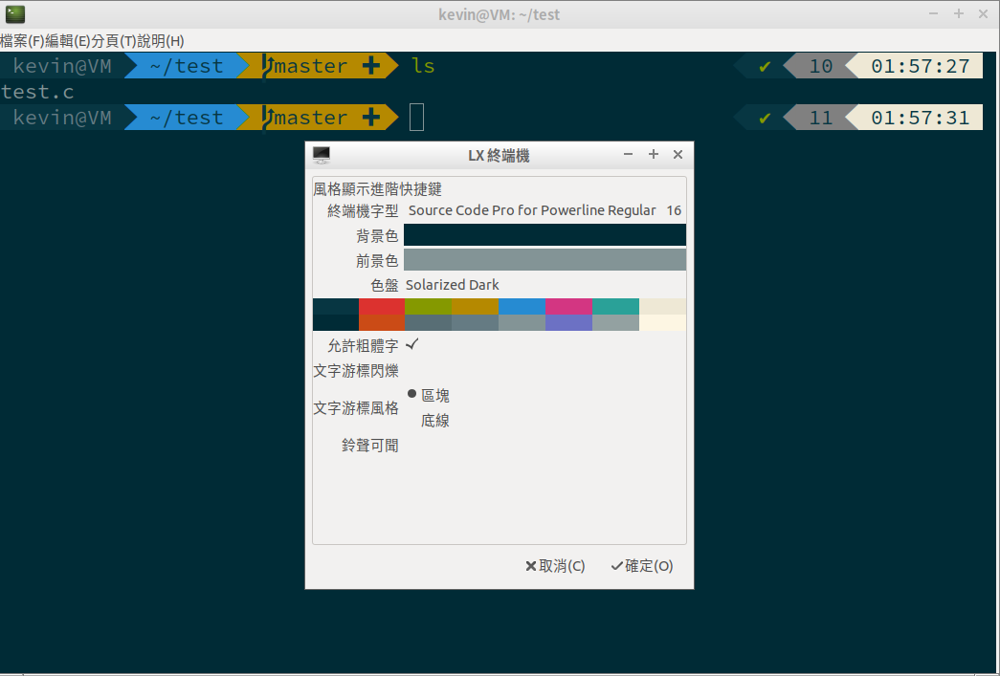

# ZSH

Install ZSH

    sudo apt-get install zsh
    sudo apt-get install powerline fonts-powerline

Lubuntu 18.04.3 apt install 
fonts-powerline failed, git clone and install manually

    # clone
    git clone https://github.com/powerline/fonts.git --depth=1
    
    # install
    cd fonts
    ./install.sh

    # clean-up a bit
    cd ..
    rm -rf fonts
    
    sudo fc-cache -f -v

Change default shell to zsh

    chsh -s /bin/zsh

Install oh-my-zsh

    git clone https://github.com/robbyrussell/oh-my-zsh.git ~/.oh-my-zsh

Enable encoding support of Chinese character

    vim ~/.zshrc

    export LC_ALL=en_US.UTF-8
    export LANG=en_US.UTF-8

    source ~/.zshrc
## ZSH Themes

Go to [https://github.com/robbyrussell/oh-my-zsh/wiki/Themes](https://github.com/robbyrussell/oh-my-zsh/wiki/Themes)
and pick up theme you like

Then modify .zshrc configuration

    vim ~/.zshrc
    ZSH_THEME="THEME_NAME"
---
## Related Utils
Powerlevel9k ZSH Theme

    sudo apt-get install zsh-theme-powerlevel9k

    echo "source /usr/share/powerlevel9k/powerlevel9k.zsh-theme" >> ~/.zshrc

Highlighting support

    sudo apt-get install zsh-syntax-highlighting

    echo "source /usr/share/zsh-syntax-highlighting/zsh-syntax-highlighting.zsh" >> ~/.zshrc
---
## Font

- [https://github.com/powerline/fonts](https://github.com/powerline/fonts)

- [https://github.com/ryanoasis/nerd-fonts](https://github.com/ryanoasis/nerd-fonts)

## Terminal Color Scheme

lxterminal palette has built in solarized 

For Gnome terminal

- [https://github.com/Mayccoll/Gogh](https://github.com/Mayccoll/Gogh)

---

## Reference

- [https://linuxhint.com/install_zsh_shell_ubuntu_1804/](https://linuxhint.com/install_zsh_shell_ubuntu_1804/)

- [https://maxim-danilov.github.io/make-linux-terminal-great-again/](https://maxim-danilov.github.io/make-linux-terminal-great-again/)
- [https://medium.com/appworks-school/%E7%BE%8E%E5%8C%96%E4%BD%A0%E7%9A%84%E7%B5%82%E7%AB%AF%E6%A9%9F-7af0dabcf368](https://medium.com/appworks-school/%E7%BE%8E%E5%8C%96%E4%BD%A0%E7%9A%84%E7%B5%82%E7%AB%AF%E6%A9%9F-7af0dabcf368)